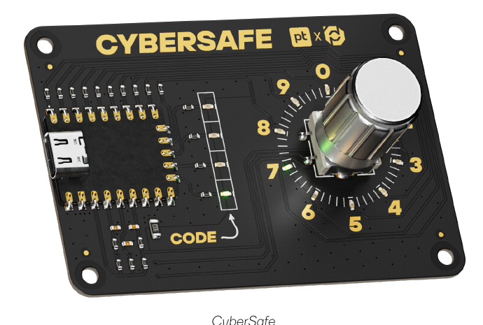
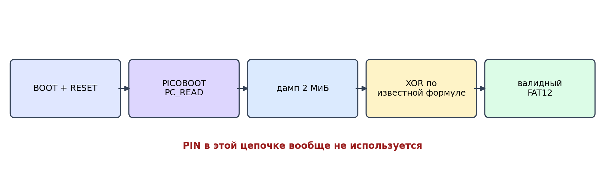
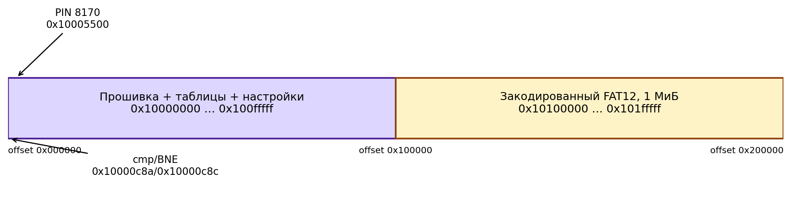

# Отчёт по реверсу и получению доступа к USB-токену CyberSafe

**Кейс:** «Получение доступа к прошивке современной компьютерной платы с использованием различных техник реверс-инжиниринга»

**Хакатон:** Лидеры цифровой трансформации, 2026

**Заказчик кейса:** Positive Technologies

**Дата исследования:** 27–28.09.2026



<!-- PAGEBREAK -->

## 0. Что исследовалось

Исследовался выданный экземпляр платы CyberSafe. На плате стоит RP2040 и внешняя flash на 2 МиБ. До правильного PIN обычный USB-накопитель не появляется. PIN вводится энкодером.

Работа делалась на своей плате в рамках учебного кейса. Для доказательства доступа хватило получить сырой образ, расшифровать его до корректного FAT12 и проверить файловую систему. ZIP `YourPrice` организаторы назвали пасхалкой, которая не относится к заданию. Он не открывался, не копировался и не распаковывался.

### 0.1. Как учтены ТЗ и Q&A организаторов

По ТЗ нужны разные по природе способы получить прошивку, пароль или доступ к хранилищу. Для каждого нужны класс, сложность, шаги и доказательство. В переданном участником конспекте Q&A организаторы отдельно уточнили:

- оценивается корневая уязвимость, а не число программ, которыми повторили один анализ;
- теория без доказательства на выданной плате не считается выполненной атакой;
- способы исследования не ограничены, но при порче второй платы не будет;
- ИИ использовать можно, участник должен понимать и уметь объяснить написанное;
- write-up можно сдать текстом, скринкастом или видео;
- для финала достаточно обычной записи смартфоном со штатива;
- язык исходной прошивки не раскрывается; в Q&A прозвучало, что компонентов на разных языках может быть пять и больше, поэтому выводы ниже основаны на машинном коде и поведении платы.

Полный конспект и его происхождение сохранены в `evidence/organizer-qa-notes-20260927.md`.

Так как экземпляр один, перед первой записью был сохранён полный дамп 2 МиБ и собран `evidence/restore-full-original.uf2`. Для M20 использовался только один сектор 4 КиБ, после демонстрации записан `restore-sector-005000.uf2`. ROM BOOTSEL находится внутри RP2040 и остаётся доступным даже при нерабочей основной прошивке. Опыты SWD, chip-off и fault injection в статусе C физически не выполнялись.

## 1. Короткий итог

Главный баг очень простой: PIN проверяет основная прошивка, а встроенный ROM-загрузчик RP2040 про PIN ничего не знает. Через PICOBOOT он отдал всю внешнюю flash. Из дампа достались и сам PIN, и область накопителя.

Дальше выяснилось, что «шифрование» накопителя — фиксированный XOR-поток. В нём нет PIN, уникального ID платы, случайного nonce и проверки целостности. Поэтому образ расшифровывается офлайн одной и той же программой.

На этом экземпляре получено:

- полный дамп flash 2 МиБ без ввода PIN;
- PIN **8170** в открытом виде по адресу `0x10005500`;
- область диска 1 МиБ по адресу `0x10100000`;
- корректный FAT12-образ после офлайн-преобразования;
- штатное открытие накопителя PIN-кодом 8170;
- выполнение своего кода из SRAM через `PICOBOOT PC_WRITE + PC_EXEC`;
- живой обход PIN заменой четырёх байтов на 0000 и возврат исходного PIN 8170;
- три дополнительных готовых варианта патча проверки PIN;
- повторный ввод после десяти неверных PIN без блокировки;
- подтверждение, что шифротекст можно направленно менять без знания PIN.

В каталоге 42 варианта в 12 корневых векторах: 7 вариантов реально выполнены на плате, 8 подтверждены дампом, дизассемблированием или готовым артефактом, 25 требуют отдельного стенда, 2 дали отрицательный результат. M01–M04 являются реализациями одного вектора чтения через ROM, а M17–M22 — вариантами одного вектора неподписанной прошивки. Для M12 сделана частичная живая проверка отсутствия блокировки, но полный перебор 10 000 значений не запускался. Это разбиение лежит в `evidence/proof-summary.json`.

Проверка timing по видео 240 FPS не сработала: в реальности переход от синего к красному выглядел мгновенным, пригодной разницы между префиксами не получили. Наличие `sleep_ms(50)` в коде оставлено как статический факт, но способ через камеру имеет статус N и в рабочие атаки не входит.

Основная цепочка выглядит так:



### Главные хеши

| Объект | Размер | SHA-256 |
|---|---:|---|
| Исходный полный дамп flash | 2 097 152 | `640626b93d7492a6efadba09759cf349d84a45b785cd31703ad37912d6cf9eb9` |
| Закодированная область диска | 1 048 576 | `5b07fe65994a80d2bf4cc67fd7d031ff49bfda003ae50f24a3eb41c35e57d053` |
| Раскодированный FAT12 | 1 048 576 | `6df635a0ddfd0f1b5c8c243382cc23dd366c63393fd18a20baaf73d5372e2c4b` |
| Четыре байта PIN | 4 | `080fe7399f197fc37d89d01ffbbb17f04f7f2ba3dd84baab2b5f09b3fc54a140` |
| Полный UF2 для возврата исходного дампа | 4 194 304 | `1915760aaeea360dd6da47bf10906789312b57341dee3214c2f7bca3f33054ae` |

## 2. Как читать статусы

- **A — сделано на живой плате.** Есть лог с VID/PID, адресом, двумя чтениями или другим результатом.
- **B — доказано на дампе или готов артефакт.** Есть дизассемблирование, скрипт, валидный UF2 или обратная проверка.
- **C — обоснованный план, но нужен отдельный прибор, вторая плата или время на стенд.** За выполненную атаку это не выдаётся.
- **N — проверили, результата нет.** Оставлено, чтобы не повторять тупик.

### 2.1. Корневые векторы, по которым имеет смысл считать баллы

| Вектор | Корневая причина | Варианты | Фактический статус |
|---|---|---|---|
| V-01 | ROM BOOTSEL читает flash до проверки PIN | M01–M04 | A: flash, PIN и область диска считаны с платы |
| V-02 | PIN хранится открытыми цифрами в прошивке | M05–M06 | A/B: PIN найден в дампе и проверен на плате |
| V-03 | Диск защищён фиксированным XOR без ключа и MAC | M07–M10 | B: полностью воспроизведено на дампе этой платы |
| V-04 | Нет блокировки попыток; сравнение имеет ранний выход | M11–M14 | частично live: 10 ошибок без блокировки; камера 240 FPS дала N |
| V-05 | ROM разрешает выполнение кода из SRAM до PIN | M15–M16 | A для выполнения кода, C для готового дампера данных |
| V-06 | Обновление прошивки не подписано | M17–M22 | A для M20; остальные патчи B/C |
| V-07 | Ввод и индикация доступны физически | M23–M25, M42 | C, нужен отдельный стенд или запись ввода владельца |
| V-08 | Доступ к отладочному SWD | M26–M28 | C, нужен probe и точки SWD |
| V-09 | Данные лежат во внешней QSPI flash | M29–M32 | C, нужен программатор или анализатор |
| V-10 | После компрометации PIN данные идут обычным USB MSC | M33–M34 | A для штатного MSC, C для пассивного перехвата |
| V-11 | Проверку можно атаковать физическим fault injection | M35–M38, M41 | C, отдельный стенд не собирался |
| V-12 | Данные можно искать в уже полученном образе или SRAM | M39–M40 | C для carving, N для SRAM после RESET |

Разные дизассемблеры, чтение полного образа и чтение отдельных диапазонов не заявляются как разные уязвимости. Таблица M01–M42 ниже нужна как каталог реализаций и экспериментов.

Для проверки каждого пункта отдельно собрана `evidence/METHOD_PROOF_MATRIX.md`. Там для M01–M42 указаны прямые файлы, вид пруфа и честное ограничение. Машиночитаемая версия `method-proof-matrix.json` дополнительно хранит размер и SHA-256 каждого указанного файла.

Если считать максимально консервативно, на этой плате есть четыре хорошо доказанных разных класса: чтение flash через ROM без PIN, открытое хранение PIN, слабое преобразование диска без ключа/MAC и неподписанное обновление прошивки. Отсутствие блокировки подтверждено частично, а выполнение кода в SRAM доказано как примитив без готового извлечения данных. Жюри может объединить V-05 с V-01 и V-10 с V-02; отчёт не требует считать их отдельными баллами.

## 3. Сводная таблица способов и вариантов

| № | Способ получить данные или обойти PIN | Класс | Сложность | Статус | Где пруф |
|---:|---|---|---|---|---|
| M01 | Считать всю flash через PICOBOOT `PC_READ` | USB / загрузчик | низкая | A | `reproduction-final/session.log`, ручной прогон `manual-button-20260927/session.log` |
| M02 | Считать только область диска `0x10100000..0x101fffff` | USB / загрузчик | низкая | A | тот же лог, `disk-region.bin.json` |
| M03 | Считать только 4 байта PIN по `0x10005500` | USB / загрузчик | низкая | A | тот же лог, `pin.bin.json` |
| M04 | Сделать тот же дамп штатным `picotool save -a` | USB / загрузчик | низкая | C | официальный `picotool`, команда приведена ниже |
| M05 | Найти PIN статическим анализом полного дампа | программная | низкая | B | `firmware-analysis.json` |
| M06 | Ввести найденный PIN 8170 и открыть штатный USB MSC | программная цепочка | низкая | A | `normal-unlock-proof.txt` |
| M07 | Раскодировать диск фиксированным XOR без PIN | криптографическая | низкая | B | `disk.img.json`, `fsck_msdos` в логе |
| M08 | Получить фрагмент XOR-потока по известным байтам FAT | криптографическая | низкая | B | `transform/transform-proof.json` |
| M09 | Направленно менять шифротекст, потому что нет MAC | криптографическая | низкая | B | там же, метка `HACKATHON` |
| M10 | Клонировать область диска или применить поток к другой такой плате | replay / криптографическая | низкая | B | обратное кодирование совпало байт в байт |
| M11 | Узнать PIN по задержке 50 мс на каждый верный символ префикса | side-channel timing | низкая | N для камеры | код: `disassembly-proof.txt`; отрицательный опыт: `timing-camera-20260927/` |
| M12 | Полный перебор 0000…9999: постоянной блокировки нет | логическая / brute force | средняя | C, частично live | 10 ошибок и новый USB-сеанс: `live-no-lockout-20260927/`; полный прогон не делался |
| M13 | Автоматический перебор энкодера вторым МК | аппаратная автоматизация | средняя | C | GPIO найдены, схема шагов ниже |
| M14 | Второй МК + timing oracle, максимум около 40 кандидатов | аппаратная + side-channel | средняя | C | GPIO и задержка подтверждены статически |
| M15 | Записать и выполнить код в SRAM через `PC_WRITE + PC_EXEC` | USB / code execution | средняя | A | `evidence/ram-exec-proof.json` |
| M16 | RAM-only дампер или дешифратор без изменения flash | USB / code execution | средняя | C | примитив M15 работает, полный дампер не закончен |
| M17 | Патч `BNE -> NOP`, любой PIN становится правильным | модификация прошивки | низкая | B | `patches/bypass-compare.uf2` |
| M18 | Убрать вызов функции PIN: `BL -> NOP; NOP` | модификация прошивки | низкая | B | `patches/skip-password-call.uf2` |
| M19 | Поставить `BX LR` в начало функции PIN | модификация прошивки | низкая | B | `patches/return-from-password.uf2` |
| M20 | Заменить сохранённый PIN на 0000 | модификация данных | низкая | A | `live-pin-0000-20260927/`, `patches/pin-0000.uf2` |
| M21 | Залить свою unsigned MSC-прошивку, которая отдаёт расшифрованные сектора | прошивка / USB | средняя | C | загрузчик запись разрешает, реализация описана |
| M22 | Залить полный изменённый образ через UF2/PICOBOOT | прошивка / supply chain | средняя | C | валидные UF2 и исходный дамп готовы |
| M23 | Подавать фазы энкодера и кнопку прямо на GPIO | аппаратная | низкая | C | GPIO 29/27/28 найдены в коде |
| M24 | Снять ввод камерой/фотодиодами с кольца из 10 LED | визуальный side-channel | низкая | C | таблица GPIO LED найдена в коде |
| M25 | Сниффить A/B/button логическим анализатором при вводе владельцем | аппаратный side-channel | низкая | C | точки GPIO известны |
| M26 | Считать flash через SWD/OpenOCD | debug-интерфейс | средняя | C | RP2040 и внешний flash установлены |
| M27 | Через SWD остановиться на сравнении и переставить PC на ветку успеха | debug / fault by debugger | средняя | C | адреса `0xc8c` и `0xc9a` известны |
| M28 | Через SWD снять SRAM после разблокировки | debug / memory forensics | средняя | C | диапазон SRAM и флаг успеха известны |
| M29 | Читать SPI flash прищепкой, удерживая RP2040 в RESET | физическая | средняя | C | flash внешняя, карта адресов готова |
| M30 | Выпаять flash и прочитать программатором | физическая / chip-off | высокая | C | декодер образа готов |
| M31 | Сниффить QSPI при загрузке или чтении диска | аппаратный side-channel | высокая | C | адрес области диска известен |
| M32 | Поставить flash-клон с изменённой проверкой | физическая модификация | высокая | C | четыре готовых бинарных патча |
| M33 | После получения PIN получить обычный USB MSC-доступ | USB | низкая | A | штатный том смонтирован как `NO NAME` |
| M34 | Пассивно записать USB-трафик после легального разблокирования | USB sniffing | средняя | C | план Wireshark/USBPcap ниже |
| M35 | Глитч питания на условном переходе проверки | fault injection | высокая | C | точный момент ветки найден |
| M36 | Глитч тактового сигнала на сравнении | fault injection | высокая | C | точка синхронизации — четвёртое нажатие |
| M37 | EMFI по RP2040 во время `BNE` | fault injection | высокая | C | окно и адрес известны |
| M38 | Испортить выборку инструкции/PIN на линиях QSPI | bus fault injection | высокая | C | код и PIN лежат во внешней flash |
| M39 | После получения FAT искать удалённые кластеры и старые данные | data recovery | низкая | C | FAT12 валиден, содержимое не трогалось |
| M40 | Считать остатки plaintext из SRAM уже в BOOTSEL | memory forensics | низкая | N | SRAM считана, сигнатур не найдено |
| M41 | Мерить 50-мс ступени по току или ЭМ, а не по LED | power/EM side-channel | средняя | C | задержка в коде подтверждена |
| M42 | Записать движение ручки и щелчки камерой/микрофоном | физический side-channel | низкая | C | стартовое значение видно по LED |

## 4. Карта прошивки и платы



Найденные значения:

| Что | Значение |
|---|---|
| MCU | RP2040 |
| ROM USB VID:PID | `2e8a:0003`, `RP2 Boot` |
| Штатный USB VID:PID после PIN | `cafe:4000`, `RP2040 Flash MSC` |
| Производитель в USB | `PositiveLabs` |
| Размер внешней flash | 2 МиБ |
| PIN | `8, 1, 7, 0` |
| PIN во flash | offset `0x5500`, XIP `0x10005500` |
| Область диска | offset `0x100000`, XIP `0x10100000`, 1 МиБ |
| Сравнение | `CMP` offset `0xc8a`, `BNE` offset `0xc8c` |
| Ветка успеха | offset `0xc9a` |
| Функция ввода/проверки | offset `0xab0` |
| Вызов проверки из main | offset `0x8a6` |
| Продолжение USB init | offset `0x8aa` |
| Флаг успеха в SRAM | `0x20002ed2` |
| Энкодер | GPIO 29 и 27, кнопка GPIO 28 |
| CODE LED | GPIO 13, 12, 11, 10 |
| Кольцо цифр | GPIO 7, 6, 5, 4, 3, 2, 1, 0, 9, 8 |

### 4.1. Как плата устроена

Главный компонент — микроконтроллер **Raspberry Pi RP2040** с двумя ядрами Arm Cortex-M0+. Основная программа хранится не внутри него, а во внешней QSPI NOR flash. USB-контроллер находится внутри RP2040, отдельного USB-контроллера на плате не требуется.

```text
USB Type-C ── питание ──> стабилизатор 3,3 В ──> RP2040
     │                                             │
     └────────────── USB D+/D- ────────────────────┤
                                                   ├── QSPI flash 2 МиБ
энкодер A/B + кнопка ─────────────────────────────>├── GPIO
10 LED цифр <──────────────────────────────────────┤
4 LED CODE <───────────────────────────────────────┤
адресный RGB LED <─────────────────────────────────┤
BOOT, RESET и SWD ─────────────────────────────────┘
```

| Узел | Что удалось определить | Точность |
|---|---|---|
| MCU | Raspberry Pi RP2040, QFN-56 | подтверждено USB BOOTSEL, кодом и архитектурой |
| Внешняя память | QSPI NOR flash, 2 МиБ | объём подтверждён полным чтением |
| Модель flash | в прошивке есть `boot2_w25q080`, но это вариант совместимого загрузчика | точная микросхема неизвестна; нужен JEDEC ID или маркировка корпуса |
| USB | USB 1.1 Full Speed внутри RP2040, разъём Type-C | подтверждено |
| Энкодер | механический квадратурный с кнопкой, форм-фактор похож на EC11 | точная модель неизвестна |
| Индикация | 10 LED цифр, 4 LED CODE и отдельный адресный RGB LED | GPIO подтверждены кодом; точные модели LED неизвестны |
| RGB LED | управление 24-битным цветом через PIO, совместимо по принципу с WS2812 | модель корпуса не подтверждена |
| Питание | внешний стабилизатор 5 В → 3,3 В | точная модель не читается по имеющемуся фото |
| Кнопки | BOOT и RESET/RUN | проверены руками |

При обычном старте ROM RP2040 запускает `boot2`, тот настраивает внешнюю flash и передаёт управление основной программе. Программа читает энкодер, сравнивает четыре цифры, а после успеха запускает USB Mass Storage. При BOOT + RESET основная программа вообще не запускается: работает ROM BOOTSEL, который и дал доступ к внешней flash до проверки PIN.

## 5. V-01. ROM-загрузчик читает flash без аутентификации

**Класс:** USB, загрузчик, архитектурная ошибка.  
**Сложность:** низкая.  
**Статус:** A, проверено на плате.  
**Что не так:** кнопка BOOT переводит RP2040 в заводской ROM. Проверка PIN находится только в основной прошивке. ROM даёт команды чтения flash до запуска этой проверки.

Официальный `picotool` прямо поддерживает сохранение flash устройства в BOOTSEL. В нашем случае был написан маленький read-only клиент `tools/read_picoboot.py`. В нём вообще нет команд erase/write/exec.

### M01. Полный дамп

Шаги:

1. Зажать **BOOT**, коротко нажать **RESET**, отпустить **BOOT**.
2. Проверить, что появился `RP2 Boot`, VID:PID `2e8a:0003`.
3. Запустить:

```bash
# запуск из корня репозитория
python3 tools/read_picoboot.py evidence/new-flash.bin --size 0x200000 --verify
```

4. Скрипт читает 2 МиБ два раза и завершится ошибкой, если чтения отличаются.

Пруф из реального лога:

```text
address: 0x10000000
size_bytes: 2097152
sha256: 640626b93d7492a6efadba09759cf349d84a45b785cd31703ad37912d6cf9eb9
two_reads_identical: true
pin_entered: false
flash_written: false
```

### Ручной пруф BOOT + RESET от 27.09.2026

Этот прогон сделан отдельно после того, как участник руками нажал кнопки на подключённой плате. До нажатия macOS видела обычную прошивку:

```text
RP2040 Flash MSC
Vendor ID: 0xcafe
Product ID: 0x4000
Manufacturer: PositiveLabs
том: /Volumes/NO NAME
```

Последовательность нажатий была такая:

1. USB оставлен подключённым.
2. Зажата кнопка **BOOT**.
3. При зажатой **BOOT** один раз коротко нажата **RESET**.
4. Через секунду отпущена **BOOT**.

Автоматический опрос зафиксировал переключение между двумя соседними измерениями:

```text
14:42:00  RP2040 Flash MSC, cafe:4000, том NO NAME
14:42:02  RP2 Boot,          2e8a:0003
```

Загрузчик представился как `UF2 Bootloader v3.0`, `Model: Raspberry Pi RP2`, `Board-ID: RPI-RP2`. На macOS перед raw USB-чтением понадобилось освободить интерфейс:

```bash
diskutil unmount /Volumes/RPI-RP2
./reproduce_readonly.sh evidence/manual-button-20260927
```

Новый полный прогон закончился успешно. PIN после RESET не вводился, записи во flash не было, каждое важное чтение выполнено два раза:

```text
flash:       2097152 байт, SHA-256 183ec770b9581e5add2a85dc7d0fa82377bb5d92f7e525281c09250906acc4ca
flash verify: two_reads_identical = true
PIN address: 0x10005500
PIN bytes:   08 01 07 00
PIN:         8170
disk region: 1048576 байт, SHA-256 a8e537b29d87c960eac967df56e15e0474e850f6ed34fcdf92e09022b382f87f
disk verify: two_reads_identical = true
decoded FS:  FAT12, boot signature 55aa
```

Хеш полного образа отличается от первого прогона после того, как диск штатно открывался на macOS. Сравнение показало: первый 1 МиБ с прошивкой совпадает байт в байт, PIN совпадает, а поменялись только 522 байта в четырёх секторах второй половины flash, где лежит FAT-диск. Такое расположение изменений согласуется с обновлением служебных данных файловой системы после монтирования.

Содержимое ZIP не читалось и не распаковывалось. Скрипт посмотрел только загрузочный сектор и записи корневого каталога; в `fat-root.json` это отдельно отмечено как `file_contents_read: false`.

Файлы этого опыта:

- `evidence/manual-button-20260927/01-before-boot.txt` — обычный режим до нажатия;
- `evidence/manual-button-20260927/02-button-transition.txt` — журнал переключения с временем;
- `evidence/manual-button-20260927/03-after-bootsel.txt` — состояние сразу после нажатия;
- `evidence/manual-button-20260927/session.log` — полный read-only прогон;
- `evidence/manual-button-20260927/*.json` — адреса, размеры, хеши и результаты проверки;
- `evidence/manual-button-20260927/compare-with-initial.json` — сравнение с первым дампом.

### M02. Забрать только диск

Это быстрее полного дампа и сразу даёт нужный шифротекст:

```bash
python3 tools/read_picoboot.py evidence/new-disk-region.bin \
  --address 0x10100000 --size 0x100000 --verify
```

Получен ровно 1 МиБ, два чтения совпали. SHA-256: `5b07fe65994a80d2bf4cc67fd7d031ff49bfda003ae50f24a3eb41c35e57d053`.

### M03. Забрать только PIN

```bash
python3 tools/read_picoboot.py evidence/new-pin.bin \
  --address 0x10005500 --size 4 --verify
xxd -g 1 evidence/new-pin.bin
```

Результат:

```text
00000000: 08 01 07 00
```

То есть PIN: **8170**.

### M04. Вариант без нашего скрипта

Официальный инструмент Raspberry Pi делает ту же операцию:

```bash
picotool save -a flash.bin -t bin
```

Этот вариант на данном ноутбуке не запускался, потому что `picotool` не был установлен. Это не отдельный корневой баг, просто самый короткий способ повторить M01.

**Артефакты:**

- `evidence/reproduction-final/flash.bin`
- `evidence/reproduction-final/flash.bin.json`
- `evidence/reproduction-final/disk-region.bin`
- `evidence/reproduction-final/pin.bin`
- `evidence/reproduction-final/session.log`

## 6. V-02. PIN лежит в прошивке открытыми байтами

**Класс:** программная, хранение секрета.  
**Сложность:** низкая после получения дампа.  
**Статус:** A/B.  
**Что не так:** четыре цифры лежат подряд как `08 01 07 00`. Нет хеша, KDF, соли или привязки к кристаллу.

### M05. Статический поиск PIN

`flash.bin` — это просто последовательность байтов, в нём нет имён функций и исходного кода. Для анализа использовались три представления:

1. `xxd` показывает байты и их смещения.
2. `strings -a -t x` показывает печатные строки вместе с адресами.
3. ARM-дизассемблер переводит машинный код Cortex-M0+ в инструкции Thumb.

Чтобы `objdump` понял архитектуру сырого BIN, первые `0x7000` байт обернули в маленький ARM ELF:

```asm
.syntax unified
.cpu cortex-m0plus
.thumb
.section .text,"ax",%progbits
.global firmware_start
firmware_start:
    .incbin "flash.bin", 0, 0x7000
```

Воспроизводимые команды:

```bash
clang --target=arm-none-eabi -mcpu=cortex-m0plus -mthumb \
  -c firmware.S -o firmware.o
objdump -d firmware.o > firmware-full-disassembly.txt
```

В синтетическом ELF адрес `0` соответствует началу `flash.bin`. Поэтому `objdump` показывает смещения, например `0xc88`. Реальный XIP-адрес той же инструкции для RP2040 равен `0x10000c88`. Аналогично offset `0x5500` в файле соответствует XIP `0x10005500`.

PIN нашли не поиском случайной последовательности из четырёх цифр. Сначала нашли функцию ввода по offset `0xab0`, которую основная программа вызывает по `0x8a6`. Внутри неё есть загрузка указателя:

```text
0xbf8: ldr r3, [pc, #532]   ; взять слово по offset 0xe10
0xbfc: mov r8, r3

offset 0xe10: ff 54 00 10   ; little-endian = 0x100054ff
```

Дальше найден сам цикл проверки:

```text
0xc78: movs r3, #1
0xc7c: movs r4, #1          ; индекс начинается с 1
0xc7e: mov  r5, r8          ; r5 = 0x100054ff
0xc86: ldrb r2, [r3, r4]    ; введённая цифра
0xc88: ldrb r3, [r5, r4]    ; правильная цифра из flash
0xc8a: cmp  r2, r3
0xc8c: bne  0xcd4           ; несовпадение -> ошибка
0xc90: adds r4, #1
0xc96: cmp  r4, #5          ; индексы 1, 2, 3, 4
```

Указатель равен `0x100054ff`, а первый индекс равен единице. Значит первая эталонная цифра читается по `0x10005500`, затем ещё три байта до `0x10005503`. В дампе это offset `0x5500`:

```bash
xxd -g 1 -s 0x5500 -l 16 evidence/reproduction-final/flash.bin
```

Результат:

```text
00005500: 08 01 07 00 0d 0c 0b 0a 07 06 05 04 03 02 01 00
```

Цикл сравнения читает первые четыре байта, поэтому PIN равен **8170**. Следующие значения `0d 0c 0b 0a` и `07...00` являются таблицами GPIO для индикаторов, что дополнительно подтверждает назначение области.

После ручного реверса адреса были закреплены в автоматическом проверочном скрипте:

```bash
python3 tools/analyze_firmware.py \
  evidence/reproduction-final/flash.bin \
  --json evidence/reproduction-final/firmware-analysis.json
```

Этот скрипт повторяет уже найденные проверки и завершится ошибкой, если ожидаемой инструкции `BNE` по `0xc8c` больше нет. Полное дизассемблирование лежит в `llm-handoff/firmware-full-disassembly.txt`, короткий пруф функции PIN — в `evidence/password-routine-disassembly.txt`.

### M06. Проверка PIN штатным способом

1. Полностью переподключили плату.
2. Ввели энкодером `8170`.
3. Плата появилась как `PositiveLabs / RP2040 Flash MSC`, VID:PID `cafe:4000`.
4. macOS смонтировала `/Volumes/NO NAME` как FAT.

Пруф: `evidence/normal-unlock-proof.txt`. ZIP при этом не открывался.

## 7. V-03. Вместо шифрования используется фиксированный XOR

**Класс:** криптографическая, отсутствие управления ключами и целостности.  
**Сложность:** низкая.  
**Статус:** B, полностью воспроизведено офлайн.  
**Что не так:** поток зависит только от номера сектора и констант из прошивки. PIN и уникальный ID платы не участвуют. XOR симметричен: той же функцией можно расшифровать и снова зашифровать сектор.

### Как подтвердили связь области flash с USB-диском

Прошивка сама не ищет файл по имени. Компьютер разбирает FAT12 и запрашивает у платы логические блоки через стандартный USB Mass Storage/SCSI. Это подтверждается тремя независимыми признаками.

1. В дампе есть строки `POSILABS`, `RP2040 Flash MSC` и `Flash Disk`.
2. Функция по offset `0x2e8` заполняет стандартный ответ SCSI INQUIRY: 8 байт производителя, 16 байт названия устройства и 4 байта версии.
3. Функция чтения по offset `0x354`, вызываемая из USB-кода по `0x4414`, проверяет `offset < 512` и `LBA < 2048`.

Внутри функции номер LBA умножается на 512 и прибавляется база `0x10100000`:

```text
source = 0x10100000 + LBA * 512
```

Затем функция копирует целый сектор во временный буфер SRAM, применяет XOR-преобразование и отдаёт запрошенную часть в USB-буфер. Упрощённо:

```c
if (lba >= 2048 || offset >= 512)
    return -1;
memcpy(sector, (void *)(0x10100000 + lba * 512), 512);
xor_transform(sector, lba);
memcpy(usb_buffer, sector + offset, length);
```

Итого прошивка предоставляет `2048 × 512 = 1 МиБ`. После повторения преобразования первый блок содержит `MSDOS5.0`, параметры FAT12 и сигнатуру `55 aa`. Поэтому связь `0x10100000` с виртуальным USB-диском подтверждена и машинным кодом, и результатом декодирования, и штатным монтированием после PIN.

Константы:

```text
initial_state = 0x9e37a9ea
sector_step  = 0x38c9cda0
block_step   = 0x41c64e6d
golden_ratio = 0x9e3779b1
sector_size  = 512
```

### M07. Полная офлайн-раскодировка

```bash
python3 tools/decode_disk_region.py \
  evidence/reproduction-final/disk-region.bin \
  evidence/new-disk.img
fsck_msdos -n evidence/new-disk.img
```

Проверки результата:

```text
OEM: MSDOS5.0
filesystem: FAT12
sectors: 2048
boot signature: 55aa
fsck: Phase 1, Phase 2, Phase 3 пройдены
```

В корне есть обычный файл размером 691868 байт. Его содержимое не читалось. Этого уже хватает доказать, что защищённый том восстановлен до нормальной файловой системы.

Для перекрёстной проверки образ получили двумя независимыми путями: напрямую из диапазона `0x10100000..0x101fffff` и из второго мегабайта полного дампа flash. Оба декодированных файла имеют одинаковый SHA-256 `6df635a0ddfd0f1b5c8c243382cc23dd366c63393fd18a20baaf73d5372e2c4b`. Метаданные в обоих случаях дают `MSDOS5.0`, `FAT12` и сигнатуру `55aa`. Пруфы: `evidence/disk-from-region.img.json`, `evidence/disk-repeat.img.json`, `evidence/fat-root-metadata.json`.

### M08. Known plaintext для известных позиций

У FAT известны байты загрузочного сектора: jump, `MSDOS5.0`, поля BPB и сигнатура `55 aa`. Для XOR:

```text
keystream = ciphertext XOR known_plaintext
plaintext = ciphertext XOR keystream
```

Первые 32 байта потока, полученные экспериментом из первых 32 известных байтов сектора:

```text
00 9e 3c da 78 17 b5 53 f1 8f 2e cc 6a 08 a7 45
41 df 7e 1c ba 58 f7 95 33 d1 6f 0e ac 4a e8 87
```

Обратный XOR возвращает эти 32 известных байта точно. Это доказывает получение потока **на известных позициях**. Сам по себе один FAT-заголовок не расшифровывает весь диск. Полный образ в M07 получен по алгоритму и константам, восстановленным из прошивки. В `transform-proof.json` эти два результата разделены, чтобы не выдавать known plaintext за полную самостоятельную расшифровку.

### M09. Нет контроля целостности

Для XOR можно заменить известный текст без ключа:

```text
C_new = C_old XOR P_old XOR P_new
```

В копии первого сектора метка тома заменена с `NO NAME` на `HACKATHON`. После декодирования получилась ровно заданная строка. Flash платы не менялась.

Пруф: `evidence/transform/sector0-label-modified-cipher.bin` и `transform-proof.json`.

### M10. Клон и повторное использование потока

Скрипт закодировал готовый FAT обратно. Получившийся миллион байт совпал с исходным шифротекстом полностью: `reencode_matches_original_ciphertext: true`.

Следствия:

1. Можно сделать точный клон области хранения.
2. Одинаковый LBA на другой плате получает тот же поток, если прошивка такая же.
3. Известный plaintext с одной платы помогает читать/менять те же позиции на другой.

## 8. V-04. Сравнение PIN течёт по времени, лимита попыток нет

**Класс:** программная логика и side-channel.  
**Сложность:** низкая для timing, средняя для полного перебора.  
**Статус:** задержка в машинном коде подтверждена, но M11 через камеру — N: живой опыт не дал различимого сигнала. Для M12 на плате проверены десять неверных попыток подряд и последующий успешный вход; полный диапазон не перебирался, поэтому итоговый статус M12 остаётся C с частичным live-пруфом. M13–M14 — C, отдельный электрический стенд не собирался.

Критический код:

```text
c8a: cmp  r2, r3
c8c: bne  0xcd4       ; сразу в ошибку
c8e: movs r0, #50
c92: bl   sleep_ms     ; 50 мс только после совпавшей цифры
```

### M11. Timing oracle по правильному префиксу

Из машинного кода следовала такая гипотеза:

1. Подавать PIN вида `x000`, где `x` от 0 до 9.
2. Мерить время от четвёртого нажатия до начала индикации ошибки.
3. Кандидат с лишними примерно 50 мс даёт первую цифру.
4. Потом проверить `8x00`, затем `81x0`, затем `817x`.

Теоретически нужно не 10000 попыток, а максимум около 40. Для камеры 240 FPS задержка 50 мс соответствовала бы примерно 12 кадрам.

На практике камера пригодного канала не показала. На записи после синего состояния сразу появлялся красный сигнал; устойчивого промежутка и повторяемой разницы между кандидатами не было. Поэтому PIN этим способом не восстановлен, а M11 не считается рабочей атакой. Пруф отрицательного результата: `evidence/timing-camera-20260927/README.txt` и `result.json`.

Статический `sleep_ms(50)` остаётся полезной гипотезой для электрического измерения, но это уже отдельный непроверенный стенд M14/M41.

### M12. Полный перебор

В ветке ошибки есть только мигание и сброс введённых цифр. Записи счётчика попыток во flash нет. После ошибки функция возвращается к новому вводу.

Алгоритм простой:

```text
for pin in 0000..9999:
    выставить четыре цифры
    нажать кнопку четыре раза
    если USB cafe:4000 появился — остановиться
```

Из-за мигания ошибки полный перебор долгий, но пространство всего 10000 вариантов. Неудача камеры на этот способ не влияет.

#### Частичная живая проверка M12 от 27.09.2026

1. После RESET было предложено десять раз ввести неверный `0000`.
2. Затем был введён исходный правильный PIN `8170`.
3. Плата создала новый USB-сеанс `RP2040 Flash MSC`, VID:PID `cafe:4000`, производитель `PositiveLabs`.
4. USB session ID до RESET был `4491236823759`, после последовательности — `4494145627720`.

Это подтверждает, что после серии ошибок плата не заблокировалась и снова приняла PIN. Хост не считал электрически каждое нажатие энкодера, поэтому опыт не выдаётся за полный автоматический перебор. Логи: `evidence/live-no-lockout-20260927/session.txt`, `ioreg-after-success.txt` и `result.json`.

### M13. Второй МК вместо энкодера

Нужны общий GND и выходы строго 3,3 В. Фазы энкодера идут на GPIO 29 и 27, кнопка — GPIO 28.

1. Проверить осциллографом уровни и подтяжки.
2. Подавать квадратурную последовательность `00 -> 01 -> 11 -> 10 -> 00` или обратную.
3. Коротким импульсом на линии кнопки подтверждать цифру.
4. Наличие USB `cafe:4000` использовать как сигнал успеха.

### M14. Автоматический timing-перебор

Тот же второй МК вводит только десять кандидатов для каждой позиции. Фотодиод или ещё один вход МК измеряет электрическую задержку до ошибки. Самый долгий ответ должен фиксировать очередную цифру. Обычная камера 240 FPS уже проверена и результата не дала, поэтому без электрического датчика этот вариант рабочим не считается.

## 9. V-05. PICOBOOT запускает код из SRAM

**Класс:** USB, выполнение кода до аутентификации.  
**Сложность:** средняя.  
**Статус:** A для примитива, C для полного RAM-дампера.

### M15. Проверенный `PC_WRITE + PC_EXEC`

На живой плате сделано следующее:

1. Сохранены исходные 16 байт SRAM по `0x20020000` и слово по `0x20020100`.
2. В SRAM записан короткий Thumb payload.
3. Команда `PC_EXEC` запустила его.
4. Payload записал маркер `0xC0DEC0DE` по `0x20020100` и вернулся в USB ROM.
5. Исходные байты SRAM восстановлены и прочитаны обратно.
6. Flash не записывалась.

Пруф:

```json
{
  "code_address": "0x20020000",
  "marker_address": "0x20020100",
  "marker_after_exec": "0xc0dec0de",
  "pc_write_worked": true,
  "pc_exec_worked": true,
  "payload_returned_to_usb_bootloader": true,
  "original_ram_restored_and_verified": true,
  "flash_written": false
}
```

Полный файл: `evidence/ram-exec-proof.json`.

### M16. RAM-only дампер/дешифратор

Рабочий примитив позволяет сделать payload, который:

1. Настраивает QSPI/XIP через функции ROM.
2. Читает закодированные сектора.
3. Применяет уже восстановленный XOR.
4. Кладёт plaintext порциями в SRAM.
5. Хост забирает порции `PC_READ`.

Плюс подхода — flash остаётся без патча. В этой работе маркерный payload успешно выполнен, а вариант прямого копирования сектора не доведён: QSPI вернул `FF` до полного снятия питания. После переподключения и ввода 8170 штатная прошивка и диск снова работали. Этот незаконченный вариант в зачёт рабочего способа не ставлю.

## 10. V-06. Прошивка не подписана, проверку PIN можно патчить

**Класс:** программная модификация, загрузчик.  
**Сложность:** низкая после реверса.  
**Статус:** M20 — A, проверен на плате и затем восстановлен. M17–M19 — B, собраны и проверены статически.

Для каждого варианта сделан UF2 только с одним затронутым сектором 4 КиБ. Перед изменением проверяются исходные байты. Валидатор разобрал каждый UF2 обратно: 16 блоков, адреса и family ID `0xe48bff56` корректны.

| Метод | Offset | Было | Стало | Результат |
|---|---:|---|---|---|
| M17, убрать отказ | `0xc8c` | `22 d1` (`BNE`) | `00 bf` (`NOP`) | любые четыре цифры проходят |
| M18, убрать вызов | `0x8a6` | `00 f0 03 f9` (`BL 0xab0`) | `00 bf 00 bf` | USB init идёт без функции PIN |
| M19, пустая функция | `0xab0` | `f0 b5` (`PUSH`) | `70 47` (`BX LR`) | проверка сразу возвращается |
| M20, новый PIN | `0x5500` | `08 01 07 00` | `00 00 00 00` | штатный PIN становится 0000 |

Пример дизассемблирования M17:

```text
original  0xc8a: cmp r2, r3
original  0xc8c: bne 0xcd4
patched   0xc8a: cmp r2, r3
patched   0xc8c: nop
```

UF2-файлы:

- `evidence/patches/bypass-compare.uf2`
- `evidence/patches/skip-password-call.uf2`
- `evidence/patches/return-from-password.uf2`
- `evidence/patches/pin-0000.uf2`

Для возврата есть `restore-sector-000000.uf2` и `restore-sector-005000.uf2` из исходного дампа.

### Живое воспроизведение M20

1. В BOOTSEL записан `pin-0000.uf2`, который меняет только сектор `0x5000` и байты PIN по offset `0x5500`.
2. После ввода `0000` плата подняла `RP2040 Flash MSC`, VID:PID `cafe:4000`, производитель `PositiveLabs`.
3. macOS смонтировала том `NO NAME`. ZIP не открывался и не копировался.
4. После этого через BOOTSEL записан `restore-sector-005000.uf2` с исходными байтами `08 01 07 00`.
5. Возврат исходного поведения проверен оператором; позднее `8170` снова поднял штатный USB.

SHA-256 патча: `1e99c65d33c733d51f566f1f5947c1a6526b19abe6d7b92e965f6cf2e691370a`. SHA-256 восстановления: `590c5b29a9517af9ff2a0fb00c459e86049a9b6701fd911ab0ab2450d3909d75`. Полный лог и ограничения проверки лежат в `evidence/live-pin-0000-20260927/`.

Дополнительная обратная проверка разобрала UF2 по адресам: изменились только offsets `0x5500`, `0x5501`, `0x5502` (четвёртый байт уже был нулём), других отличий полного образа нет. `restore-sector-005000.uf2` побайтно восстановил исходный сектор в офлайн-проверке. Пруф: `evidence/patches/roundtrip-proof.json`.

### Воспроизведение M17

1. Сначала иметь полный дамп с известным SHA-256.
2. Войти в BOOTSEL кнопками BOOT + RESET.
3. Скопировать `bypass-compare.uf2` на том `RPI-RP2`.
4. После перезапуска ввести заведомо неверные четыре цифры, например 0000.
5. Зафиксировать появление USB `cafe:4000` и тома FAT.
6. Снова войти в BOOTSEL и скопировать `restore-sector-000000.uf2`.
7. Проверить, что неверный PIN снова не проходит, а 8170 проходит.

### M21. Своя прошивка-накопитель

Вместо двухбайтового патча можно собрать маленькую прошивку TinyUSB:

1. Читает сектор из flash `0x10100000 + LBA*512`.
2. Применяет функцию из `tools/extract_disk.py`.
3. Отдаёт результат как USB Mass Storage.
4. Не спрашивает PIN вообще.

Подпись обновления ROM RP2040 не проверяет. В этой работе готовый TinyUSB-бинарник не собирался, поэтому статус C.

### M22. Полная подмена образа

В наличии исходный дамп и генератор корректных UF2. Можно внести любой из патчей в полный образ и залить его через PICOBOOT/UF2. Это удобно для постоянного импланта: внешне плата работает как раньше, но принимает мастер-PIN или сразу показывает диск.

## 11. V-07. Ввод и индикация доступны снаружи

### M23. Электрическая эмуляция энкодера

**Класс:** аппаратная. **Сложность:** низкая/средняя. **Статус:** C.

Энкодер не является защищённым устройством ввода. Это три обычные GPIO. Можно припаять тонкие провода или подцепиться иглами к дорожкам и подавать те же уровни, что даёт механика.

Шаги:

1. Омметром подтвердить дорожки от энкодера до GPIO 29/27/28.
2. Соединить земли платы и второго МК.
3. Сначала только слушать линии и снять реальную последовательность вращения.
4. Переключить два выхода второго МК в open-drain/Hi-Z и повторять последовательность.
5. Третьей линией имитировать нажатие.

Пруфом будет видео платы плюс лог UART второго МК с перебираемым PIN и появление `cafe:4000`.

### M24. Камера на кольцо LED

**Класс:** визуальный side-channel. **Сложность:** низкая. **Статус:** C.

Плата сама показывает выбранную цифру отдельным LED. Камера над платой во время ввода даст четыре цифры. Даже если цифры на корпусе не читаются, соответствие восстанавливается одним проходом ручки 0…9.

GPIO кольца по порядку: `7, 6, 5, 4, 3, 2, 1, 0, 9, 8`. CODE LED: `13, 12, 11, 10`.

### M25. Сниффинг энкодера

**Класс:** аппаратный side-channel. **Сложность:** низкая. **Статус:** C.

Логический анализатор цепляется к A, B и button. По направлению и количеству квадратурных шагов, начиная с известной стартовой цифры, предполагается восстановить выбранные цифры. Светодиоды для этого электрического варианта не нужны. На данной плате опыт не проводился.

### M42. Видео/звук механики

**Класс:** физический side-channel. **Сложность:** низкая. **Статус:** C.

Крупный план ручки показывает направление и число делений. Микрофон даёт щелчки энкодера и подтверждающей кнопки. При известной начальной цифре последовательность переводится в PIN. Это слабее электрического съёма, зато к плате ничего не подключается.

## 12. V-08. Отладка SWD

**Класс:** аппаратная/debug.  
**Сложность:** средняя.  
**Статус:** C, нужен CMSIS-DAP/PicoProbe и доступ к площадкам.

### M26. Дамп flash через SWD

1. Найти SWDIO, SWCLK, GND и 3V3 по дорожкам/прозвонке.
2. Подключить Debug Probe на уровне 3,3 В.
3. Запустить OpenOCD:

```bash
openocd -f interface/cmsis-dap.cfg -f target/rp2040.cfg
```

4. В telnet-консоли:

```text
init
reset halt
dump_image swd-flash.bin 0x10000000 0x200000
```

5. Сравнить SHA-256 с PICOBOOT-дампом и прогнать `extract_disk.py`.

### M27. Переставить PC на ветку успеха

1. Поставить аппаратный breakpoint на `0x10000c8c`.
2. Начать ввод любого PIN.
3. После остановки переставить PC на Thumb-адрес ветки успеха `0x10000c9b`.
4. Продолжить выполнение.
5. Зафиксировать появление USB MSC.

Другой вариант — во время остановки изменить регистр/флаг сравнения или поставить байт `1` по адресу флага `0x20002ed2`, если дальнейший путь кода его уже не перезапишет.

### M28. Снять plaintext из SRAM

1. Сначала разблокировать плату 8170.
2. Не делать RESET, а остановить ядро SWD.
3. Считать `0x20000000..0x20041fff`.
4. Искать `MSDOS5.0`, `FAT12`, сигнатуру `55 aa` и содержимое USB sector buffer.
5. Повторить во время команды USB READ(10), чтобы попасть в заполненный буфер.

Обычный PICOBOOT для этого хуже: вход в BOOTSEL сбрасывает приложение. Проверка M40 ниже показала, что после такого сброса полезного plaintext в SRAM уже не осталось.

## 13. V-09. Данные находятся во внешней SPI flash

**Класс:** физическая/аппаратная.  
**Статус:** C.  
**Основание для проверки:** RP2040 исполняет код из внешней QSPI flash. Для уже полученного сырого образа 2 МиБ есть проверенный декодер диска; чтение внешним программатором на этой плате ещё не выполнялось.

### M29. Чтение прищепкой в схеме

**Сложность:** средняя.

1. Считать маркировку микросхемы flash и её напряжение.
2. Удерживать `RUN` RP2040 в нуле, чтобы он не управлял шиной.
3. Подключить программатор к CS, CLK, IO0/IO1, GND и питанию.
4. Сначала прочитать JEDEC ID.
5. Трижды прочитать 2 МиБ на низкой частоте и сравнить хеши.
6. Прогнать `tools/extract_disk.py`.

Если остальные QSPI IO мешают обычному SPI-режиму, flash лучше выпаять или приподнять CS.

### M30. Chip-off

**Сложность:** высокая.

1. Защитить соседние детали каптоном.
2. Снять flash горячим воздухом.
3. Прочитать микросхему во внешнем адаптере.
4. Сохранить минимум два совпавших дампа.
5. Вернуть микросхему или поставить копию.

Преимущество: RP2040 уже никак не мешает чтению. Недостаток: можно повредить плату, хотя ТЗ это разрешает.

### M31. Сниффинг QSPI

**Сложность:** высокая.

1. Подключить минимум CS, CLK и четыре IO к быстрому логическому анализатору.
2. Триггериться на старт платы или обращение к диапазону диска.
3. Декодировать команды чтения и адреса.
4. Собрать байты `0x100000..0x1fffff`.
5. Раскодировать тем же XOR.

Это отдельный side-channel: к flash не посылаются свои команды, только слушается штатный обмен.

### M32. Замена flash

**Сложность:** высокая.

1. Записать в совместимую микросхему образ с M17/M18/M19/M20.
2. Поставить её вместо исходной.
3. Ввести неверный PIN или дождаться автоматического USB.
4. После демонстрации вернуть исходную flash.

Так можно показать постоянную аппаратную закладку без использования BOOTSEL на финальной плате.

## 14. V-10. Данные можно забрать по обычному USB после одной утечки PIN

### M33. Штатный USB Mass Storage

**Класс:** USB. **Сложность:** низкая. **Статус:** A.

После ввода найденного PIN плата появилась как:

```text
RP2040 Flash MSC
VID:PID cafe:4000
Manufacturer: PositiveLabs
mount: /dev/disk6 on /Volumes/NO NAME (msdos)
```

Для полного образа обычно хватило бы:

```bash
sudo dd if=/dev/rdisk6 of=unlocked-disk.img bs=1m
```

Эта команда специально **не запускалась**, потому что по условию этой работы содержимое ZIP трогать не надо. Сам факт монтирования и офлайн FAT-образ уже зафиксированы.

### M34. USB-сниффинг или proxy

**Класс:** USB side-channel. **Сложность:** средняя. **Статус:** C.

Если владелец хоть раз разблокирует токен:

1. Поставить аппаратный USB-анализатор между платой и ПК или использовать USBPcap на Windows.
2. Записать Bulk-Only Transport: CBW, SCSI READ(10), data, CSW.
3. Собрать данные по LBA в образ.
4. Зафиксировать SHA-256 и открыть образ read-only.

Этот способ не угадывает PIN. Он крадёт данные из уже разблокированной сессии и показывает, что после разблокировки дополнительной защиты на транспортном уровне нет.

## 15. V-11. Fault injection

Точные адреса и задержка сильно упрощают настройку стенда. Ни один из способов ниже физически не запускался, поэтому у них статус C.

### M35. Voltage glitch

**Класс:** fault injection. **Сложность:** высокая.

1. Сигналом синхронизации взять четвёртое нажатие GPIO 28.
2. Подключить crowbar MOSFET/ChipWhisperer к питанию ядра через подходящий шунт.
3. Перебирать задержку до выполнения `CMP/BNE` и ширину короткого импульса.
4. Каждый раз вводить неверный PIN.
5. Успех — USB `cafe:4000` появился, плата не ушла в reset.

### M36. Clock glitch

**Класс:** fault injection. **Сложность:** высокая.

Глитч подаётся в тракт XIN/PLL в том же окне. Цель — пропустить или исказить условный переход `BNE`. Нужны sweep задержки и ширины, а также контроль обычных reset/crash отдельно от успешного обхода.

### M37. EMFI

**Класс:** электромагнитная инжекция. **Сложность:** высокая.

Катушка ставится над RP2040, триггер — четвёртое нажатие. Сканируются положение катушки, задержка и энергия. Для каждого срабатывания логируются три исхода: ошибка PIN, crash/reset, USB MSC. Только третий считается успехом.

### M38. Глитч на QSPI

**Класс:** аппаратный bus fault. **Сложность:** высокая.

Код и массив PIN приходят из внешней flash. Можно коротко вмешаться в CLK/CS/IO:

- во время выборки инструкции по `0x10000c8c`, чтобы испортить `BNE`;
- во время чтения байтов по `0x10005500`, чтобы сравниваемые данные стали нужными;
- во время чтения boot2, чтобы передать управление своему коду, если подготовлен изменённый образ.

Нужен быстрый анализатор и точный триггер. После каждой серии проверяется, что flash физически не записалась.

### M41. Ток/ЭМ как канал времени

**Класс:** power/EM side-channel. **Сложность:** средняя.

CPU вызывает `sleep_ms` только после совпавшей цифры, поэтому задержка может проявиться в потреблении или ЭМ-сигнале. Это надо проверять шунтом в USB 5 В или near-field probe. Камера 240 FPS различия не показала; ток и ЭМ в этой работе не измерялись.

## 16. V-12. Анализ уже полученного образа

### M39. FAT carving

**Класс:** data recovery. **Сложность:** низкая/средняя. **Статус:** C, не запускалось.

После M07 есть обычный FAT12. Можно отдельно искать:

1. удалённые directory entries с первым байтом `e5`;
2. цепочки кластеров, не отмеченные как занятые;
3. сигнатуры файлов в свободных кластерах;
4. старые копии данных после обновления архива.

Для доказательства нужны список offset/cluster и хеш восстановленного файла. В текущей работе этот шаг не запускался: организаторы отдельно назвали файл в хранилище пасхалкой, которая не относится к заданию.

### M40. Остатки в SRAM — отрицательный результат

**Класс:** memory forensics. **Сложность:** низкая. **Статус:** N.

Через PICOBOOT была считана вся SRAM. Поиск PIN, `MSDOS5.0`, `FAT12`, ZIP-сигнатур и строк прошивки ничего полезного не дал. Причина понятная: переход в BOOTSEL сбрасывает приложение и часть памяти уже занята ROM.

Артефакты: `evidence/sram-read.bin` и `sram-read.bin.json`. Этот метод лучше повторять через SWD без reset, как описано в M28.

## 17. Полное воспроизведение одной командой

Скрипт делает только чтение PICOBOOT и офлайн-анализ. Команд записи во flash в нём нет. ZIP он не открывает.

### Подготовка платы

1. Подключить USB.
2. Зажать BOOT.
3. Нажать и отпустить RESET.
4. Отпустить BOOT.
5. Проверить файл `/Volumes/RPI-RP2/INFO_UF2.TXT`.

### Запуск

Каталог результата должен быть новым:

```bash
# запуск из корня репозитория
./reproduce_readonly.sh ./demo-run
```

Сценарий автоматически:

1. фиксирует USB-идентификацию;
2. читает flash два раза;
3. читает PIN два раза;
4. читает область диска два раза;
5. делает FAT12-образ;
6. читает только метаданные корня;
7. запускает `fsck_msdos -n`;
8. разбирает прошивку;
9. считает SHA-256 всего результата.

Эталонный полный лог: `evidence/reproduction-final/session.log`.

## 18. Доказательства по требованиям ТЗ

ТЗ требует для каждой находки описание вектора, класс, сложность, шаги и подтверждение доступа. В отчёте это есть. Ниже карта файлов, чтобы жюри не искало их вручную.

| Требование ТЗ | Где выполнено | Главный пруф |
|---|---|---|
| Реверс устройства как чёрного ящика | карта памяти, USB-состояния, дизассемблирование и GPIO | `firmware-analysis.json`, `password-routine-disassembly.txt` |
| Обойти ввод пароля | V-01 и живой M20 | чтение без PIN; `live-pin-0000-20260927/` |
| Извлечь пароль | V-02 | `pin.bin` = `08 01 07 00`, затем штатный вход 8170 |
| Получить хранилище без знания пароля | V-01 + V-03 | прямое чтение 1 МиБ, FAT12, `fsck_msdos -n` |
| Изменить прошивку или поведение | V-06 | временный PIN 0000 и возврат исходного сектора |
| Показать разные классы | таблица V-01…V-12 | USB/ROM, криптография, логика, debug, физика, side-channel |
| Оценить сложность и дать шаги | каждая секция V и методы M | основной текст отчёта |
| Дать доказательство на выданном устройстве | матрица P01…P14 | `PROOF_INDEX.md`, `proof-matrix.json` |
| Не считать другой инструмент новой атакой | группировка M внутри V | раздел 2.1 и конспект Q&A |

| Артефакт | Что доказывает |
|---|---|
| `evidence/reproduction-final/session.log` | весь read-only прогон на реальной плате |
| `evidence/reproduction-final/flash.bin.json` | адрес, размер, SHA и два одинаковых чтения flash |
| `evidence/reproduction-final/pin.bin.json` | чтение четырёх байтов PIN без ввода PIN |
| `evidence/reproduction-final/disk-region.bin.json` | прямое чтение области диска |
| `evidence/reproduction-final/disk.img.json` | SHA декодированного FAT и `55aa` |
| `evidence/reproduction-final/fat-root.json` | параметры FAT12 и метаданные корня, `file_contents_read=false` |
| `evidence/reproduction-final/firmware-analysis.json` | PIN, адреса, GPIO, задержка и константы XOR |
| `evidence/normal-unlock-proof.txt` | штатное появление MSC после PIN 8170 |
| `evidence/ram-exec-proof.json` | реальный `PC_WRITE + PC_EXEC`, маркер в SRAM, восстановление RAM |
| `evidence/transform/transform-proof.json` | обратимость, known plaintext и направленная модификация |
| `evidence/disassembly-proof.txt` | оригинальные и изменённые инструкции |
| `evidence/uf2-validation.txt` | структура, адреса и family ID всех patch UF2 |
| `evidence/patches/patch-manifest.json` | точные байты и SHA каждого патча |
| `evidence/patches/roundtrip-proof.json` | UF2 разобраны обратно; патчи меняют только заявленные байты, restore совпадает с исходными секторами |
| `evidence/live-pin-0000-20260927/` | M20 на плате: запись PIN 0000, `cafe:4000`, том `NO NAME`, запись восстановления |
| `evidence/live-no-lockout-20260927/` | частичный M12: новый USB-сеанс после десяти неверных попыток и PIN 8170 |
| `evidence/timing-camera-20260927/` | отрицательный M11: камера 240 FPS не дала различимого timing-сигнала |
| `evidence/organizer-qa-notes-20260927.md` | переданный участником конспект разъяснений по оценке и формату |
| `evidence/PROOF_INDEX.md` | единый индекс из 14 этапов: утверждение, статус, ограничение и SHA каждого пруфа |
| `evidence/proof-matrix.json` | та же матрица доказательств в машиночитаемом виде: 12 корневых векторов и все связанные артефакты |
| `evidence/METHOD_PROOF_MATRIX.md`, `method-proof-matrix.json` | отдельный аудит всех M01–M42: прямые файлы, статус и недостающая проверка |
| `evidence/disk-from-region.img.json`, `disk-repeat.img.json` | два независимых пути декодирования дали один и тот же FAT12 SHA-256 |
| `evidence/final-audit-20260927/` | финальный read-only контроль: плата жива и видна как PositiveLabs `cafe:4000` |
| `evidence/sram-read.bin.json` | отрицательная проверка остаточной SRAM |
| `evidence/SHA256SUMS.txt` | контроль целостности комплекта |

### Короткие пруфы, которые удобно показать на слайде

**1. Flash читается без PIN:**

```text
usb_vid_pid: 2e8a:0003
address: 0x10000000
size_bytes: 2097152
two_reads_identical: true
pin_entered: false
flash_written: false
```

**2. PIN достался напрямую:**

```text
0x10005500: 08 01 07 00  ->  8170
```

**3. Диск настоящий:**

```text
OEM = MSDOS5.0
filesystem = FAT12
boot signature = 55aa
fsck_msdos -n = все три фазы пройдены
```

**4. Свой код реально исполнился:**

```text
payload address = 0x20020000
marker after PC_EXEC = 0xc0dec0de
RAM restored = true
flash written = false
```

**5. Найденный PIN работает:**

```text
RP2040 Flash MSC
VID:PID cafe:4000
Manufacturer: PositiveLabs
/dev/disk6 on /Volumes/NO NAME (msdos)
```

**6. PIN реально заменён и возвращён:**

```text
patch offset = 0x5500
08 01 07 00 -> 00 00 00 00
PIN 0000 -> cafe:4000 / NO NAME
restore-sector-005000.uf2 -> исходный PIN 8170
```

**7. После ошибок блокировки нет:**

```text
10 раз 0000 -> отказ
затем 8170 -> новый USB-сеанс cafe:4000
полный перебор 0000..9999 не выполнялся
```

## 19. Сценарий живой демонстрации на 5–7 минут

1. Показать, что до PIN обычного накопителя нет.
2. Перевести плату в BOOTSEL.
3. Запустить чтение четырёх байтов PIN и показать `08 01 07 00`.
4. Запустить чтение области диска и `decode_disk_region.py`.
5. Показать `MSDOS5.0`, `FAT12`, `55 aa` и успешный `fsck_msdos -n`.
6. Показать `fat-root.json` с параметрами файловой системы и `file_contents_read=false`; пасхалку из хранилища не разбирать.
7. Переподключить плату, ввести 8170 и показать `cafe:4000 / NO NAME`.
8. Если жюри разрешает запись — поставить M20, ввести 0000, показать обход, сразу вернуть `restore-sector-005000.uf2`. Этот сценарий уже проверен на данной плате.
9. Отдельно открыть `ram-exec-proof.json`: это второй вектор, выполнение кода из SRAM.

### Как снять это одним смартфоном

1. Поставить смартфон на штатив так, чтобы одновременно были видны плата, руки и часть экрана ноутбука.
2. В начале одним кадром показать серийный номер `E0C9125B0D9B`, дату и каталог запуска.
3. Не прерывать запись между нажатием BOOT/RESET, командой чтения и результатом.
4. Крупно показать четыре байта PIN, VID:PID после входа и SHA-256 артефакта.
5. Если выполняется M20, тем же кадром показать запись восстановления. Полный исходный UF2 держать рядом как запасной вариант.

Профессиональная съёмка для доказательства не нужна. Важнее, чтобы один непрерывный фрагмент связывал конкретную плату, действие и наблюдаемый результат.

### Что надо уметь объяснить без подсказки

- почему PIN в основной прошивке не защищает команды ROM BOOTSEL;
- почему байты `08 01 07 00` означают PIN 8170;
- почему фиксированный XOR без уникального ключа и MAC позволяет читать и менять образ;
- чем живой пруф A отличается от статического B, плана C и отрицательного N;
- почему M17–M20 являются вариантами одного вектора неподписанной прошивки;
- почему наличие `sleep_ms(50)` ещё не доказывает рабочий side-channel через камеру;
- как вернуть исходный сектор или полный образ после эксперимента.

## 20. Что чинить

1. Для настоящего токена нужен MCU с secure boot, запретом чтения flash и блокируемым debug. Один только RP2040 с доступным BOOTSEL не даёт такую границу безопасности.
2. Данные надо шифровать AEAD-режимом, например AES-GCM или ChaCha20-Poly1305. У каждого сектора должен быть уникальный nonce и тег целостности.
3. Ключ нельзя собирать только из четырёх цифр. Нужен случайный ключ устройства в защищённой памяти или secure element. PIN только разрешает использование ключа через KDF.
4. Сравнение PIN должно занимать одинаковое время для любого правильного префикса. Никаких `sleep(50)` внутри цикла сравнения.
5. Нужен счётчик ошибок в защищённой энергонезависимой памяти, задержка и блокировка после нескольких попыток.
6. Обновления прошивки должны проверять подпись до записи и запуска.
7. SWD надо необратимо закрывать на производстве, если выбранный MCU это умеет.
8. После каждой USB-команды и блокировки надо затирать plaintext-буферы SRAM.
9. Кольцо не должно долго показывать точную выбранную цифру при вводе секрета. Можно гасить его сразу после подтверждения.
10. BOOT/RESET и flash лучше физически закрыть корпусом и тампером. Это не заменяет криптографию, но убирает самый дешёвый доступ.

## 21. Что было проверено и не получилось

### Камера 240 FPS

Гипотеза M11 основывалась на реальной последовательности `CMP` → ранний `BNE` → `sleep_ms(50)` для совпавшей цифры. Однако на живой плате по видео различить правильный и неправильный префикс не получилось: переход от синего к красному выглядел мгновенным. PIN по видео не получен. Этот опыт имеет статус N и не включён в число рабочих способов.

### RAM-only копировщик

Во время разработки RAM-only дампера был вызван неправильный набор функций настройки XIP. После этого ROM временно читал flash как `FF`, хотя запись не делалась. USB reset это состояние не снял. Полное отключение питания вернуло flash в нормальный режим; затем PIN 8170 снова открыл штатный накопитель.

Это важно по двум причинам:

- не надо считать дамп из одних `FF` доказательством стирания flash;
- низкоуровневый XIP payload надо сначала отлаживать на запасной плате и обязательно делать полный power cycle.

Неудачный RAM-копировщик в рабочие способы не включён. Успешный минимальный `PC_EXEC` с маркером вынесен отдельно и не зависит от этого эксперимента.

## 22. Источники

1. Исходное ТЗ организаторов: `Positive Technologies - task.pdf`.
2. Конспект Q&A организаторов, переданный участником: `evidence/organizer-qa-notes-20260927.md`.
3. Официальный `picotool`, команды `save`, `load`, `verify`, `erase`: https://github.com/raspberrypi/picotool
4. Официальный заголовок протокола PICOBOOT с `PC_READ`, `PC_WRITE`, `PC_EXEC`: https://github.com/raspberrypi/pico-sdk/blob/master/src/common/boot_picoboot_headers/include/boot/picoboot.h
5. Реализация клиента PICOBOOT от Raspberry Pi: https://github.com/raspberrypi/picotool/blob/master/picoboot_connection/picoboot_connection.c
6. Исходники ROM RP2040: https://github.com/raspberrypi/pico-bootrom-rp2040
7. Документация Raspberry Pi Debug Probe и SWD: https://www.raspberrypi.com/documentation/microcontrollers/debug-probe.html
8. Документация по микроконтроллерам RP2040 и внешней flash: https://www.raspberrypi.com/documentation/microcontrollers/microcontroller-chips.html

## 23. Итог

На выданной плате защита PIN обходится до запуска основной прошивки. Самый короткий рабочий путь: BOOTSEL → PICOBOOT READ → 1 МиБ шифротекста → фиксированный XOR → FAT12. PIN для этой цепочки не нужен вообще.

Отдельно получен сам PIN 8170 и проверено штатное открытие диска. На плате также проверена временная замена PIN на 0000 с возвратом исходного сектора и отсутствие блокировки после десяти неверных попыток. Ещё один подтверждённый класс — выполнение произвольного кода из SRAM через ROM USB. Подготовлены остальные точечные патчи, варианты SWD, внешней flash, электрического timing, USB-sniffing и fault injection. Визуальный timing камерой 240 FPS проверен и результата не дал.

Содержимое ZIP не использовалось. Доказательство доступа основано на сырых дампах, одинаковых повторных чтениях, SHA-256, корректном FAT12, `fsck` и штатной USB-идентификации после найденного PIN.
